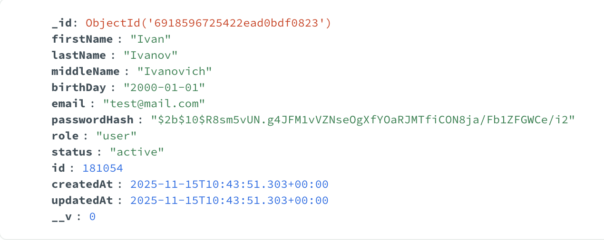
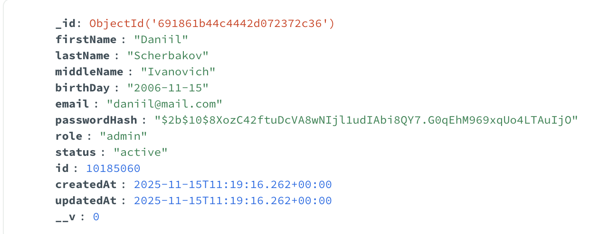
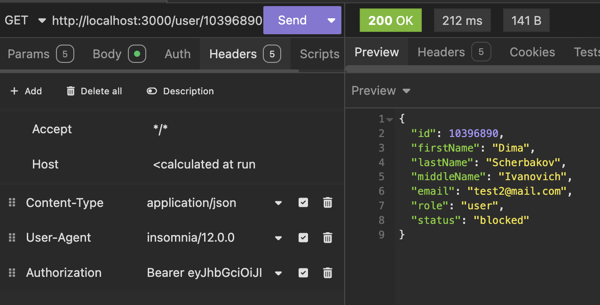
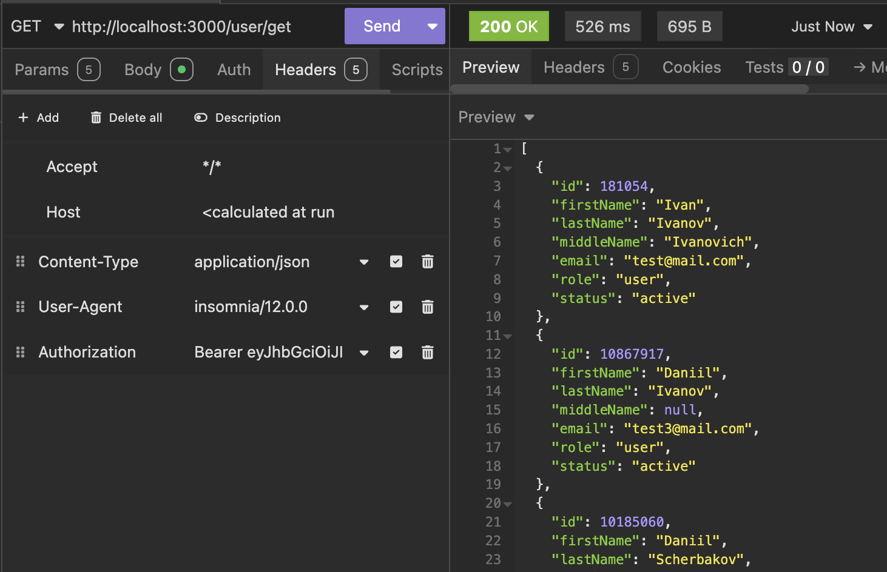
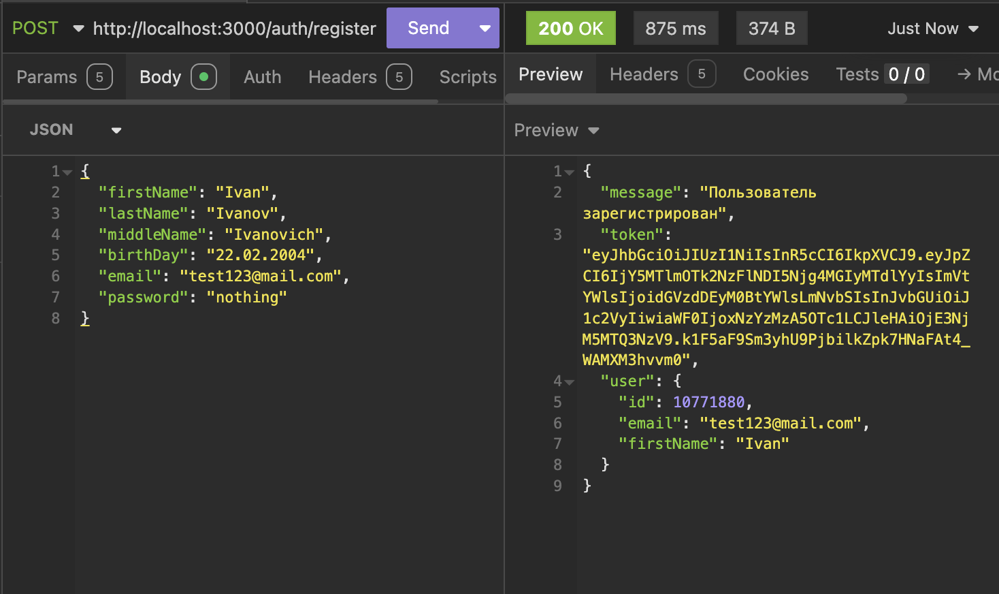
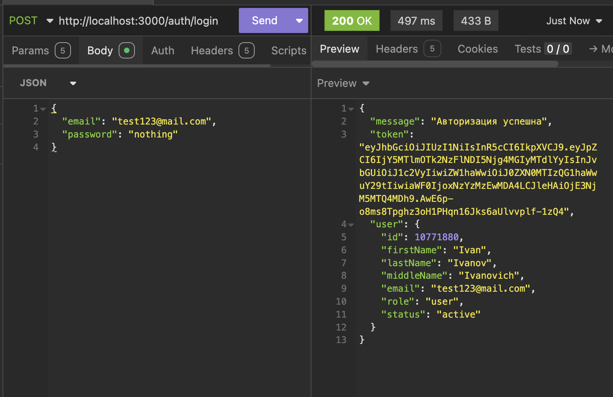

# backend

Скачать зависимости:

```bash
bun install
```

Запуск:

```bash
bun run dev
```
# Тестовое задание: Backend на TypeScript + Express + Node.js + MongoDB

## Описание

Базовый backend с регистрацией, логином и управлением пользователями.  
Используются:

- Node.js + Bun
- TypeScript
- Express
- MongoDB (MongoDB Compass для визуализации)
- JWT для аутентификации
- Insomnia для тестирования API

***

## User Example



## Admin Example



## Get User by ID



## Get All Users



## Register



## Login

